# ChainKey: Decentralized API Key State Machine

ChainKey is a Solana-based protocol designed to replace centralized API key infrastructure (DB + Redis + Auth Middleware) with a deterministic on-chain state machine. By migrating key lifecycles to the Solana ledger, ChainKey provides immutable audit trails, cryptographically enforced rate limits, and trustless credential rotation.

## Quickstart

1.  Clone & Install: `git clone https://github.com/Eniyanyosuva/ChainKey && npm install`
2.  Build Program: `anchor build`
3.  Run Test Suite: `anchor test`

---

## Architecture & Account Modeling

ChainKey utilizes a hierarchical Program Derived Address (PDA) model to decouple credential state from high-frequency usage tracking.

### PDA Hierarchy

```mermaid
graph TD
    Authority["Authority (Signer)"] -- "Seeds: [b'project', authority, project_id]" --> ProjectPDA["Project Account"]
    ProjectPDA -- "Seeds: [b'api_key', project_pda, key_index]" --> ApiKeyPDA["ApiKey Account"]
    ApiKeyPDA -- "Seeds: [b'usage', api_key_pda]" --> UsagePDA["Usage Account"]
    
    style ProjectPDA fill:#1e1e2e,stroke:#8b5cf6,stroke-width:2px
    style ApiKeyPDA fill:#1e1e2e,stroke:#06b6d4,stroke-width:2px
    style UsagePDA fill:#1e1e2e,stroke:#10b981,stroke-width:2px
```


### Why Separate ApiKey and Usage Accounts?
To maximize concurrency and reduce write contention, ChainKey separates **Static State** (ApiKey) from **Transient State** (Usage).
*   **ApiKey Account**: Stores fixed metadata (hashes, owner, limits). Rarely modified.
*   **Usage Account**: Stores hot-path counters (`request_count`, `window_start`). 
*   **Design Rationale**: This mirrors the Web2 split between a **Relational DB** (ApiKey) and **Redis/In-Memory Cache** (Usage), allowing validators to parallelize transactions across different keys within the same project.

### Account Byte-Layout & Economic Model
ChainKey utilizes a linear-growth economic model where rent storage costs are strictly proportional to the allocated account size. All accounts are required to be rent-exempt to persist in the global ledger state.

| Account Type | Fields (Discriminator included) | Size (Bytes) | Economic Role |
| :--- | :--- | :--- | :--- |
| **Project** | Auth (32) + ID (16) + Name (68) + Desc (132) + Meta (25) | 273 | Metadata Storage |
| **ApiKey** | Proj (32) + Hash (32) + Name (68) + Bitmask (8) + Meta (41) | 223 | Security Configuration |
| **Usage** | ApiKey (32) + Window (8) + Count (4) | 52 | Hot-Path Counter |

### Bitmask Scope Management
ChainKey utilizes a `u64` bitmask for permissioning, enabling O(1) membership checks and zero-allocation verification.
*   **Atomic Comparisons**: Scope checks use bitwise `AND` operations, minimizing Compute Unit usage during verification.
*   **Flexible Assignment**: Up to 64 independent permission bits can be defined. Bits 0-2 are reserved for standard roles (`0x01`: READ, `0x02`: WRITE, `0x04`: ADMIN).
*   **Efficient Persistence**: Reduces the storage footprint of the `ApiKey` account compared to legacy string-based arrays.

---

## Formal State Machine Definition

The `ApiKey` account follows a strict state transition model. Unauthorized or undefined transitions are rejected by the program runtime.

| Current State | Input Action | Next State | Authorization |
|:---|:---|:---|:---|
| **Active** | `suspend_api_key` | **Suspended** | Authority |
| **Active** | `revoke_api_key` | **Revoked** (Terminal) | Authority |
| **Active** | `verify` (Fail Count < 10) | **Active** | Public |
| **Active** | `verify` (Fail Count == 10) | **Revoked** (Terminal) | Public (Auto) |
| **Suspended** | `reactivate_api_key` | **Active** | Authority |
| **Suspended** | `revoke_api_key` | **Revoked** (Terminal) | Authority |
| **Revoked** | *Any Action* | **Error: KeyNotActive** | N/A |

**Project Lifecycle Constraints:**
- **Creation**: Authority generates a Project PDA with a unique 16-byte identifier.
- **Closure**: A project cannot be closed while `active_keys > 0` or `total_keys > 0`. 
- **Sequence**: All associated `UsageAccount` and `ApiKey` PDAs must be closed (rent reclaimed) before `close_project` is permitted.

---

## Concurrency & Runtime Locking

ChainKey leverages the Solana Sealevel runtime's parallel execution model, bounded by writable account overlap.

- **Writable Account Locking**: During a `verify` call, the program requests writable access to the `ApiKey` (for security counter updates) and the `UsageAccount` (for rate limiting). The `Project` account is typically read-only during verification.
- **Serialization Boundary**: SVM write-locks guarantee deterministic transaction ordering. Serialization occurs strictly per-ApiKey and its associated `UsageAccount`. Transactions targeting independent keys within the same Project execute in parallel.
- **Sharding & Scaling**: Throughput per key is bounded by sequential mutation of its UsageAccount; multiple transactions may execute in a slot but are strictly serialized by SVM write-locks. High-frequency clients are expected to "shard" traffic across multiple `ApiKey` PDAs to achieve horizontal scaling.
- **BPF Runtime Optimization**: Logic is optimized to minimize Compute Unit (CU) consumption, ensuring that storage I/O and cryptographic hashing remain the primary cost drivers.

---

## Adversarial & Griefing Analysis

- **Failed-Verification Griefing**: An attacker can attempt to trigger auto-revocation by submitting invalid hashes. While this constitutes a DOS against a single key, each attempt requires a valid transaction signature and gas, imposing an economic cost on the attacker.
- **Lock Contention DOS**: High-frequency submission of invalid transactions can lock the `UsageAccount` PDA for duration of the block. This impact is isolated to the specific key being attacked and does not degrade the performance of other keys or the global Project state.
- **Containment**: Independent PDA derivation ensures contention is scoped per key and does not introduce cross-key write-lock coupling.

---

## Code Quality & Rust Patterns

The program is authored using Anchor 0.30+, utilizing advanced safe-coding patterns:

*   **Inline Authorization**: Usage of `#[account(constraint = project.authority == authority.key())]` ensures that only the project creator can modify security policies.
*   **Terminal State Sink**: The `KeyStatus::Revoked` variant acts as a one-way state transition. Once a key is revoked (manually or via auto-revocation), it is mathematically impossible to move back to `Active`.
*   **Opaque Hashing Model**: ChainKey never stores or handles plaintext secrets. Verification is performed by comparing a client-provided SHA-256 hash against the stored hash. To prevent cross-protocol replay or rainbow-table attacks, the protocol assumes a domain-separated hashing strategy of the form: sha256("CHAINKEY_V1" || raw_secret).
*   **Brute-Force Mitigation**: Every failed verification path increments the `failed_verifications` counter. Upon reaching **10**, the program triggers an atomic transition to `Revoked`. This counter is reset to zero upon every successful verification, prioritizing recovery for legitimate users who intermittently provide incorrect credentials.

---

## Deterministic Execution Model

ChainKey adheres to the Solana deterministic execution environment, where state mutation only occurs within the context of a confirmed transaction.

- **Atomic Guarantees**: Any failure during verification results in a transaction revert, ensuring usage counters and security states remain consistent. There is no partial state update risk.
- **Deterministic Ordering**: SVM write-locks ensure that concurrent transactions targeting the same key are ordered sequentially. This guarantees that rate limit increments and window resets occur in a predictable, non-racy manner.
- **Zero Background Workers**: Protocol maintenance is shifted to the user-executed hot-path. There are no asynchronous state mutations or off-chain rely-on triggers.
- **Fixed-Window with Lazy Reset**: Rate limit windows do not reset automatically. The first transaction received after a window duration triggers an idempotent reset of `request_count`. Note that this model allows for "boundary burst," where a user may consume up to 2x the rate limit if they concentrate requests around the window rollover.

---

## Formal Safety Invariants

The protocol enforces the following safety invariants at the runtime level:

1.  **Terminal Revocation**: `status == KeyStatus::Revoked` is a sink state. There are no outgoing transitions.
2.  **Usage Bound**: `UsageAccount.request_count` ≤ `ApiKey.rate_limit` (evaluated post-reset).
3.  **Temporal Monotonicity**: `UsageAccount.window_start` ≤ `Clock.slot`.
4.  **Relational Integrity**: `ApiKey.project == Project.key()` and `UsageAccount.api_key == ApiKey.key()`, enforced via PDA seed derivation.
5.  **Brute-Force Mitigation**: `failed_verifications` < 10 for all `Active` keys.
6.  **Successful verification implies failed_verifications == 0 post-execution.**

---

## Compute & Cost Model

ChainKey verification is designed for deterministic execution costs.

- **Verification touches**:
    - ApiKey (writable)
    - UsageAccount (writable)
    - Project (read-only)
- **Primary CU drivers**:
    - SHA-256 comparison
    - Account deserialization
    - PDA constraint validation
- **Zero dynamic allocations**: No dynamic allocations occur during verification, preventing runtime compute variance.
- **O(1) scope checks**: Permission checks are performed via bitwise operations, ensuring constant-time complexity regardless of scope count.
- **Deterministic cost**: Compute usage is stable and bounded by fixed account sizes.

---

## Correctness & Testing

The system is validated by a 32-case integration suite proving system integrity across edge cases.

### Test Categories
*   **State Transitions**: Active → Suspended → Active; Active → Revoked.
*   **Rate Limiting**: Fixed-window with lazy reset, N+1 rejection in same slot, inheritance of project defaults.
*   **Security Thresholds**: Brute-force simulation (9 fails → ok, 10 fails → atomic revocation).
*   **Authorization**: Unauthorized signer rejection across all 11 instructions.
*   **Rent Integrity**: Assertions that project closure reclaims expected SOL to the authority wallet.

**Run All Tests**:
```bash
anchor test
```

---

## Web2 -> Solana Design Analysis

| Web2 Component | Solana Implementation | Trust / Auditability Benefit |
| :--- | :--- | :--- |
| **Key DB Table** | PDA (Seeds: [Account]) | Prevents "ghost keys"; key existence is cryptographically provable. |
| **Redis Cache** | Usage PDA | State is persistent and verifiable; no "stale cache" race conditions. |
| Auth Middleware | verify_api_key Instruction | Logic is immutable. The operator cannot bypass checks for specific users. |
| Admin Panel | Authority Signer | Ownership is enforced by Ed25519 signatures, not session cookies. |

### Engineering Tradeoffs (Honest Assessment)
*   **Latency**: Solana’s ~400ms slot time (subject to cluster conditions) is slower than local Redis (~1ms). Not suitable for extreme low-latency gateways.
*   **Cost**: Verification consumes compute and gas. Ideal for high-value API calls, not high-volume free tiers.
*   **Concurrency**: Parallelism is bounded strictly by `UsageAccount` write-lock overlap. Serialization occurs per-key, enabling horizontal scaling via multiple key issuance.

---

## Time Source & Rate Limiting Semantics

The protocol implements a fixed-window rate-limiting algorithm leveraging the Solana `Clock` sysvar for temporal consistency.

- **Time Source**: `Clock::get()?.slot` is used as the reference. Slots provide a strict validator consensus and are the native temporal unit for the Solana runtime.
- **Fixed-Window with Lazy Reset**: Requests are bucketed into discrete intervals defined by a slot delta. 
- **Semantics**:
    - If `current_slot >= window_start + window_duration`, the window is stale. 
    - The program performs an idempotent reset of `request_count` and updates `window_start` to the current slot.
    - Resets are deterministic and thread-safe due to the SVM's write-locking on the `UsageAccount`.

---

## UX & Client Usability

### CLI Usage Examples
ChainKey ships with a robust TypeScript CLI for administrative tasks.
```bash
# Create a project with slot-based rate limiting
node cli/index.js create-project --name "Main API" --rate-limit 1000

# Issue a key with specific permissions (e.g., bit indices 0,1 or hex 0x03)
node cli/index.js issue --project-id <hex> --name "Production" --scopes 0,1

# Update permissions for an existing key
node cli/index.js update-scopes --project-id <hex> --key-index 0 --scopes 0x07

# Verify a key secret with a required scope check
node cli/index.js verify --project-id <hex> --secret sk_... --scope 0x01 --simulate

# Example output:
# ✓ Key valid | Scope: 0x07 | Requests: 47/1000 | Window resets in 312s


```
*Note: The CLI supports the `--url` flag to use custom RPC endpoints, bypassing public Devnet rate limits.*

### Live Verification Dashboard
Visualizes on-chain state and allows for real-time key management.
Live Dashboard -> https://chain-key-app.vercel.app
(Visualizes PDA balances, usage slots, key status, and revocation events)

---

## Devnet Deployment

| | |
|:---|:---|
| **Program ID** | `EWGBn5r5sA9nyDyfkRNzBsr85KiMi5TUd1KY7fiQvdpF` |
| **Network** | Solana Devnet |
| **Explorer** | [View Program](https://explorer.solana.com/address/EWGBn5r5sA9nyDyfkRNzBsr85KiMi5TUd1KY7fiQvdpF?cluster=devnet) |
| **Deployment Tx** | [View Transaction](https://explorer.solana.com/tx/5umZHSYfAdwRwDHdqaz7FtwnCNCcpggcxVopC9Wh5WqT2B1GX4Kp5rVSveqGpNmVMWCP7s1ZywTpszygAiJDBYcN?cluster=devnet) |

---

## Project Refinement Summary

- **Core Logic**: Scope refactor (`u64` bitmask) is fully implemented and verified with 32/32 tests passing.
- **Frontend**: Multi-wallet support (Phantom, Solflare, Backpack) is active, and build issues are resolved.
- **CLI**: Fully synchronized with bitwise permissioning and new scope-management commands.
- **Docs**: README overhauled to professional, emoji-free technical standards with formal cost/concurrency models.

---

## Deterministic Rent Footprint

The project adheres to a predictable economic model for ledger storage.

- **Fixed-size accounts**: All account structures have constant lengths defined at compile time.
- **No dynamic reallocation**: The program does not utilize account resizing (realloc).
- **Initialization-time cost**: Total rent-exempt balance is known and locked at account creation.
- **No runtime growth**: Account sizes remain static throughout the credential lifecycle.
- **Predictable economics**: Storage overhead is fixed, enabling precise budgeting for API key infrastructure.

---

## Why This Is a Backend Rebuild
ChainKey demonstrates the transition from centralized middleware to decentralized state enforcement.

- **Logic Enforcement**: Whereas Web2 middleware enforces rules off-chain (subject to configuration drift or compromise), ChainKey enforces logic via immutable on-chain program code.
- **Consensus-Validated Transitions**: Every state change (issuance, revocation, usage increment) is validated by the Solana consensus mechanism.
- **Native Auditability**: The ledger provides a permanent, transparent record of all credential events without requiring separate logging infrastructure.
- **Distributed Backend Runtime**: This project showcases Solana as a high-performance distributed backend runtime rather than just a financial platform.

---
**Build for the Solana Rebuild Hacks | EWGBn5r5sA9nyDyfkRNzBsr85KiMi5TUd1KY7fiQvdpF**
## License
MIT